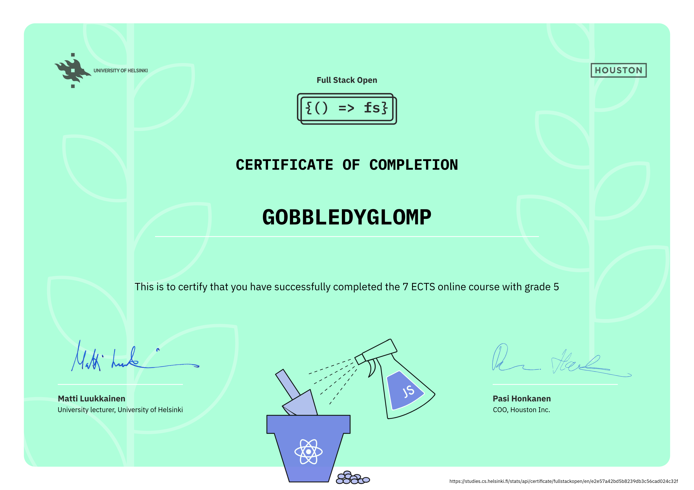

    

<h1 align="center">
    Full Stack Open
</h1>

    
    
    
    
    
    
    
    
    
    
    
    
    
    
    
    
    
    
    
    

<h2>
    Certificate
</h2>

  

<h2>
    Info
</h2>

    My solutions to the exercises of the <a href="https://fullstackopen.com/"> Full Stack Open </a> course made by the <a href="https://www.helsinki.fi/"> University of Helsinki </a>

<h2>
    Links to the solutions
</h2>

<h3>
    

        <a href="https://github.com/gobbledyglomp/full-stack-open/tree/main/part8">
            • Part 8: GraphQL
        </a>
    

    

        <a href="https://github.com/gobbledyglomp/full-stack-open/tree/main/part7">
            • Part 7: React router, custom hooks, styling app with CSS and webpack
        </a>
    

    

        <a href="https://github.com/gobbledyglomp/full-stack-open/tree/main/part6">
            • Part 6: Advanced state management
        </a>
    

    

        <a href="https://github.com/gobbledyglomp/full-stack-open/tree/main/part5">
            • Part 5: Testing React apps
        </a>
    

    

        <a href="https://github.com/gobbledyglomp/full-stack-open/tree/main/part4">
            • Part 4: Testing Express servers, user administration
        </a>
    

    

        <a href="https://github.com/gobbledyglomp/full-stack-open/tree/main/part3">
            • Part 3: Programming a server with NodeJS and Express
        </a>
    

    

        <a href="https://github.com/gobbledyglomp/full-stack-open/tree/main/part2">
            • Part 2: Communicating with server
        </a>
    

    

        <a href="https://github.com/gobbledyglomp/full-stack-open/tree/main/part1/">
            • Part 1: Introduction to React
        </a>
    

    

        <a href="https://github.com/gobbledyglomp/full-stack-open/tree/main/part0/">
            • Part 0: Fundamentals of Web apps
        </a>
    

</h3>

<h2>
    License
</h2>

    Released under <a href="https://creativecommons.org/licenses/by-nc-sa/3.0/"> Creative Commons BY-NC-SA 3.0 </a> License

